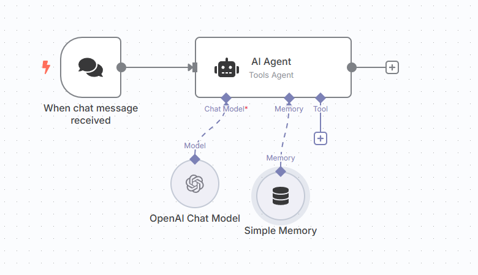
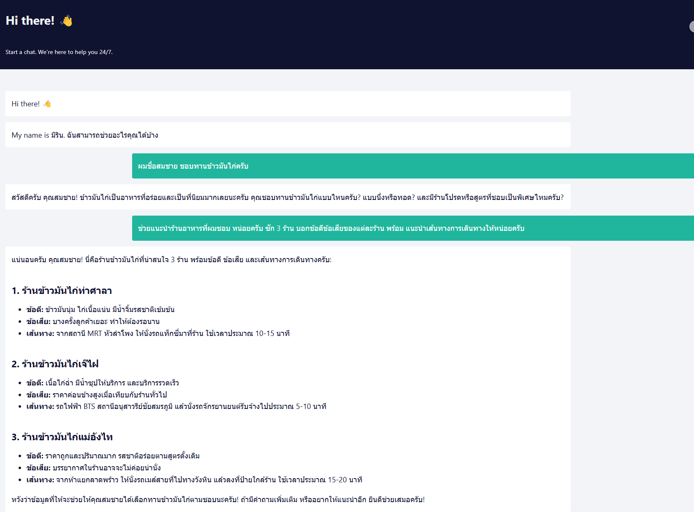
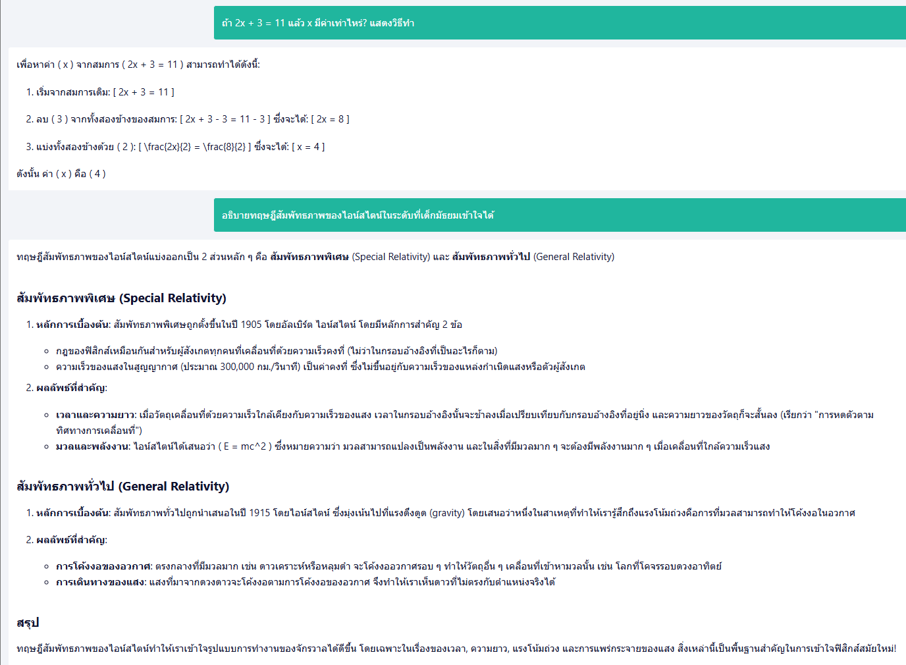

# First_AI_Agent

เวิร์กโฟลว์นี้เป็นตัวอย่างการสร้าง **AI Agent** อย่างง่ายใน n8n เพื่อรับข้อความแชทและตอบกลับโดยใช้โมเดลภาษาของ OpenAI พร้อมหน่วยความจำระยะสั้นสำหรับเก็บบริบทการสนทนา

## คำอธิบาย

Lab นี้แสดงวิธีการออกแบบเวิร์กโฟลว์ใน n8n เพื่อสร้าง AI Agent ที่สามารถประมวลผลข้อความจากผู้ใช้และตอบกลับอย่างชาญฉลาดโดยใช้โมเดล **gpt-4o-mini** จาก OpenAI และหน่วยความจำแบบ window-based เพื่อรักษาบริบทการสนทนา

## โครงสร้างและการทำงาน

เวิร์กโฟลว์ประกอบด้วย 4 โหนดหลักที่เชื่อมต่อกัน ดังนี้:

### 1. When chat message received (`chatTrigger`)
- **หน้าที่**: จุดเริ่มต้นของเวิร์กโฟลว์ รอรับข้อความแชทจากผู้ใช้
- **การตั้งค่า**: ใช้ webhook เพื่อจับข้อความ โดยไม่มีพารามิเตอร์เพิ่มเติม
- **การเชื่อมต่อ**: ส่งข้อมูลไปยังโหนด **AI Agent**

  - ใช้ `promptType: define` เพื่อกำหนดบริบทจาก `sessionId` (`{{ $json.sessionId }}`)
- **การเชื่อมต่อ**:
  - รับข้อมูลจาก **When chat message received**
  - รับโมเดลภาษาจาก **OpenAI Chat Model**
  - รับหน่วยความจำจาก **Simple Memory**

### 3. OpenAI Chat Model (`lmChatOpenAi`)
- **หน้าที่**: เรียกใช้โมเดลภาษา **gpt-4o-mini** จาก OpenAI เพื่อประมวลผลและสร้างคำตอบ
- **การตั้งค่า**:
  - ใช้บัญชี OpenAI ที่กำหนดใน credentials (`openAiApi`)
  - เลือกโมเดล `gpt-4o-mini`
- **การเชื่อมต่อ**: ส่งโมเดลภาษาไปยัง **AI Agent**

### 4. Simple Memory (`memoryBufferWindow`)
- **หน้าที่**: เก็บประวัติการสนทนาแบบระยะสั้น (window-based) เพื่อให้ AI Agent รักษาบริบทได้
- **การตั้งค่า**: ใช้ค่าเริ่มต้น ไม่มีการกำหนดพารามิเตอร์เพิ่มเติม
- **การเชื่อมต่อ**: ส่งข้อมูลหน่วยความจำไปยัง **AI Agent**

# คำถามที่น่าสนใจ

| #  | คำถาม                                                                                                |
|----|------------------------------------------------------------------------------------------------------|
| 1  | อธิบายความหมายของคำว่า "ปัญญาประดิษฐ์" ในบริบทของเทคโนโลยีสมัยใหม่                                      |
| 2  | 1+1+1+1+1+1+1+1+1+1+1 เท่ากับเท่าไหร่? อธิบายวิธีคิด                                                   |
| 3  | ถ้าคุณเป็นนก คุณอยากเป็นนกชนิดใด และเพราะอะไร?                                                        |
| 4  | เขียนบทกวีสั้น 4 บรรทัดเกี่ยวกับพระอาทิตย์ตกในภาษาไทย                                                  |
| 5  | แปลประโยคนี้เป็นภาษาอังกฤษ: "ความรู้คือพลังที่เปลี่ยนแปลงโลกได้"                                     |
| 6  | ประเทศไทยมีกี่จังหวัดในปี 2568 และจังหวัดใดมีประชากรมากที่สุด?                                       |
| 7  | ถ้าคุณมี 5 แอปเปิ้ล และให้เพื่อนไป 2 ลูก เหลือกี่ลูก? อธิบายวิธีคำนวณ                                |
| 8  | อะไรคือความแตกต่างระหว่าง "ภาวะโลกร้อน" และ "การเปลี่ยนแปลงสภาพภูมิอากาศ"?                              |
| 9  | เขียนเรื่องสั้น 50 คำเกี่ยวกับเด็กที่พบหุ่นยนต์ในป่า                                                    |
| 10 | ถ้า 2x + 3 = 11 แล้ว x มีค่าเท่าไหร่? แสดงวิธีทำ                                                       |
| 11 | อาหารไทยจานใดที่ได้รับความนิยมมากที่สุดในต่างประเทศ และเพราะอะไร?                                       |
| 12 | อธิบายทฤษฎีสัมพัทธภาพของไอน์สไตน์ในระดับที่เด็กมัธยมเข้าใจได้                                            |
| 13 | ถ้าคุณเป็น AI ที่ไม่มีร่างกาย คุณรู้สึกอย่างไรเมื่อถูกถามถึง "ความรู้สึก"?                              |
| 14 | สร้างประโยคที่มีคำว่า "ความหวัง" และ "อนาคต" ในบริบทที่สร้างแรงบันดาลใจ                                 |
| 15 | ถ้าโลกหมุนช้าลง 50% จะส่งผลต่อสิ่งมีชีวิตอย่างไร?                                                      |
| 16 | เขียนโค้ด Python สั้นๆ เพื่อคำนวณเลขฟาโบนัชชีตัวที่ 10                                                |
| 17 | อะไรคือสาเหตุหลักของการสูญพันธุ์ของไดโนเสาร์?                                                          |
| 18 | ถ้าคุณต้องออกแบบเมืองแห่งอนาคต คุณจะใส่ฟีเจอร์อะไรบ้าง?                                               |
| 19 | อธิบายความแตกต่างระหว่าง HTTP และ HTTPS ในแง่เทคนิค                                                    |
| 20 | ถ้าคุณสามารถพูดคุยกับบุคคลในประวัติศาสตร์ได้ 1 คน คุณจะเลือกใคร และถามอะไร?                            |