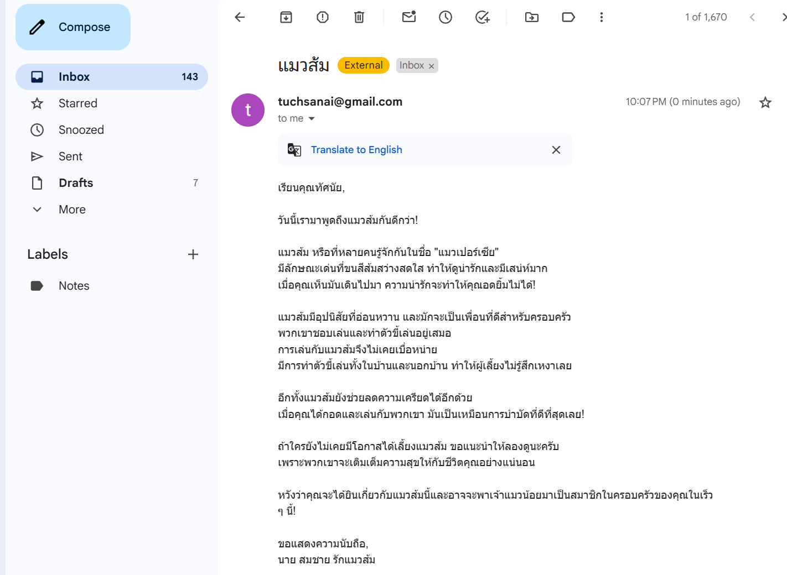

```markdown
# คำถามเกี่ยวกับฟังก์ชันการทำงานของอีเมล

1.  ช่วยแสดงรายการอีเมล 7 ฉบับล่าสุดที่ได้รับ พร้อมเวลาที่ได้รับและชื่อผู้ส่ง
2.  สามารถส่งอีเมลไปยังที่อยู่อีเมล `test@example.com` ด้วยหัวข้อ "การทดสอบระบบ" และข้อความ "นี่คือการทดสอบ" ได้หรือไม่?
3.  ช่วยตอบกลับอีเมลล่าสุดจาก `john.doe@example.com` ด้วยข้อความ "ขอบคุณสำหรับข้อความของคุณ"
4.  ระบบสามารถดึงอีเมลที่มีหัวข้อประกอบด้วยคำว่า "สำคัญ" และแสดงรายละเอียดได้หรือไม่?
5.  ช่วยแสดงจำนวนอีเมลทั้งหมดที่ได้รับในวันนี้
6.  สามารถส่งอีเมลไปยังหลายคนพร้อมกัน เช่น `user1@example.com` และ `user2@example.com` ได้หรือไม่?
7.  ช่วยตรวจสอบว่ามีอีเมลจาก `sender@example.com` ในช่วง 3 วันล่าสุดหรือไม่
8.  ระบบสามารถตอบกลับอีเมลโดยอ้างอิง `Message_ID` ของอีเมลที่ได้รับล่าสุดได้อย่างไร?
9.  ช่วยส่งอีเมลที่มีข้อความกำหนดเวลา เช่น "นัดประชุมวันนี้เวลา 14:00 น." โดยใช้ข้อมูลจากโหนด `Date & Time`
10. สามารถดึงอีเมลที่มีคำว่า "โปรเจกต์" ในเนื้อหาและแสดงผู้ส่งได้หรือไม่?
11. ช่วยส่งอีเมลทดสอบโดยกำหนดหัวข้อเป็น "ทดสอบวันที่" และเพิ่มวันที่ปัจจุบันในเนื้อหา
12. ระบบสามารถแสดงรายการอีเมล 10 ฉบับล่าสุดที่ยังไม่ได้อ่านได้หรือไม่?
13. ช่วยตอบกลับอีเมลที่มีหัวข้อ "คำขอข้อมูล" ด้วยข้อความ "กำลังดำเนินการ กรุณารอสักครู่"
14. สามารถตั้งค่าการส่งอีเมลอัตโนมัติเมื่อได้รับข้อความที่มีคำว่า "ด่วน" ในหัวข้อได้หรือไม่?
15. ช่วยแสดงรายละเอียดของอีเมลล่าสุด รวมถึงผู้ส่ง หัวข้อ และเวลาที่ได้รับ
16. ระบบสามารถส่งอีเมลที่มีเนื้อหาเป็นข้อความยาวเกิน 100 คำได้หรือไม่?
17. ช่วยตรวจสอบว่ามีอีเมลที่ส่งจากระบบไปยัง `test@example.com` ในวันนี้หรือไม่
18. สามารถดึงอีเมลที่มีไฟล์แนบและแสดงชื่อไฟล์แนบได้หรือไม่?
19. ช่วยส่งอีเมลไปยัง `info@example.com` โดยระบุว่าเป็นการทดสอบจาก `n8n Email Agent`
20. ระบบสามารถแสดงรายการอีเมลที่ได้รับในช่วงเวลา 08:00-17:00 น. ของวันนี้ได้หรือไม่?
```