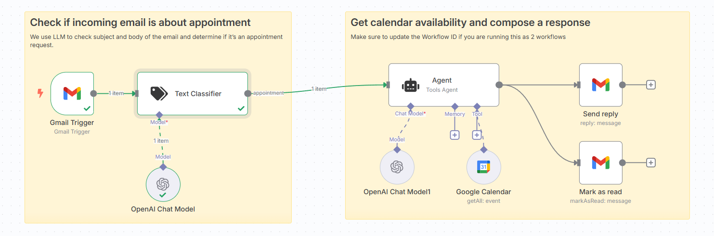
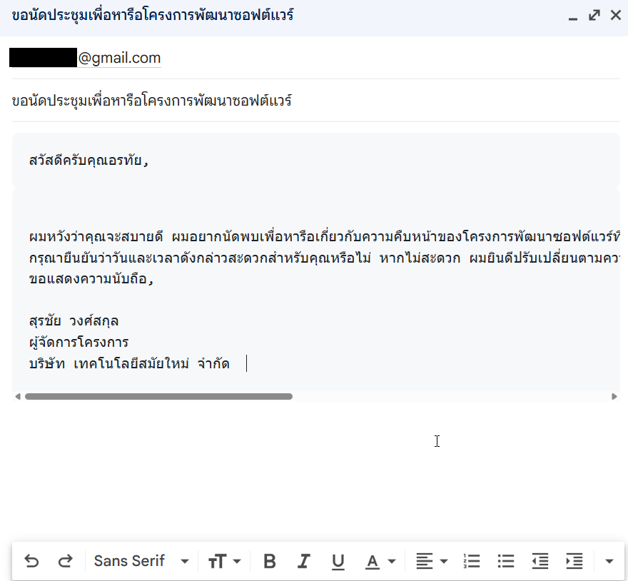
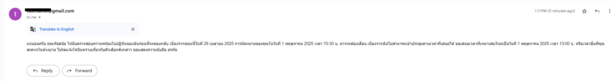

## Lab: Automated Appointment Booking and Email Reply with n8n and LLMs

### Overview
In this lab, you will build and run an n8n workflow that automatically processes incoming appointment requests via email, checks your Google Calendar for availability, and sends a professional, concise response with proposed meeting times. The workflow leverages:

- **Gmail Trigger** to listen for unread messages
- **LangChain Text Classifier** to detect appointment-related emails
- **OpenAI Chat Models** (gpt-4o-mini) for intelligent parsing and response drafting
- **Google Calendar Tool** to fetch availability
- **LangChain Agent** to orchestrate logic and compose replies
- **Gmail Node** to send email replies and mark messages as read


### Workflow Walkthrough

1. **Gmail Trigger**: Polls your inbox every minute for unread emails (including Spam/Trash).
2. **Text Classifier**: Applies a LangChain model to categorize incoming messages as `appointment` or other.
3. **Sticky Note** (Step 1): Describes the logic to analyze the email subject/body for appointment requests.
4. **OpenAI Chat Model**: Performs initial LLM processing for classification.
5. **Google Calendar**: Fetches all events from the past day to one month ahead, ensuring context for availability.
6. **Sticky Note1** (Step 2): Mentions updating workflow IDs when splitting into multiple workflows.
7. **LangChain Agent**: Receives sender, subject, snippet, and calendar data. It:
   - Checks requested times against availability
   - Proposes new time slots if conflicts exist (15-minute buffer)
   - Formats a polite, professional reply with exact date and time
   - Inserts current timestamp (ISO format) for clarity
8. **OpenAI Chat Model1**: Powers the Agent’s reasoning and drafting.
9. **Send Reply**: Uses the Gmail node to reply to the original message with the Agent’s output.
10. **Mark as Read**: Archives the email by marking it as read.

### Expected Outcome

After completing this lab, your workflow will automatically:
- Detect appointment requests in emails
- Check calendar availability
- Draft and send professional scheduling replies
- Archive processed emails

This end-to-end automation reduces manual scheduling overhead and demonstrates how to integrate AI with no-code tools for practical productivity gains.


## ต่อไปนี้คือตัวอย่างจดหมายนัดพบ 3 ฉบับ โดยสร้างตัวละครสมมติขึ้นมา พร้อมระบุการนัดหมาย:
ตัวอย่างที่ 1: นัดหมายเพื่อหารือโครงการ

```
จาก: สุรชัย วงศ์สกุล (surachai.w@company.co.th)
ถึง: อรทัย จันทร์สุข (orathai.j@company.co.th)


หัวข้อ: ขอนัดประชุมเพื่อหารือโครงการพัฒนาซอฟต์แวร์  

สวัสดีครับคุณอรทัย,  

ผมหวังว่าคุณจะสบายดี ผมอยากนัดพบเพื่อหารือเกี่ยวกับความคืบหน้าของโครงการพัฒนาซอฟต์แวร์ที่เรากำลังดำเนินการร่วมกัน ผมขอเสนอนัดพบในอีก 2 วันจากนี้เวลา 10:30 น. ที่ห้องประชุมชั้น 5 สำนักงานใหญ่  
กรุณายืนยันว่าวันและเวลาดังกล่าวสะดวกสำหรับคุณหรือไม่ หากไม่สะดวก ผมยินดีปรับเปลี่ยนตามความเหมาะสม  
ขอแสดงความนับถือ,

สุรชัย วงศ์สกุล
ผู้จัดการโครงการ
บริษัท เทคโนโลยีสมัยใหม่ จำกัด  
```

ตัวอย่างที่ 2: นัดสัมภาษณ์งาน

```
จาก: พิมพ์ใจ สุวรรณ (phimjai.s@hrsolution.co.th)
ถึง: ธนากร พานิช (thanakorn.p@gmail.com)

หัวข้อ: นัดสัมภาษณ์ตำแหน่งนักวิเคราะห์ข้อมูล  

เรียน คุณธนากร,  

ขอบคุณที่สมัครตำแหน่งนักวิเคราะห์ข้อมูลกับบริษัทของเรา ทางเราประทับใจในประวัติและผลงานของคุณ และอยากเชิญคุณมาสัมภาษณ์เพื่อพูดคุยเพิ่มเติม  
ขอเรียนเชิญคุณมาสัมภาษณ์ในอีก 5 วันจากนี้เวลา 14:00 น. ณ สำนักงานใหญ่ ชั้น 3 อาคารเอสทีพี กรุณานำเอกสารประวัติส่วนตัวและผลงานที่เกี่ยวข้องมาด้วย  
โปรดยืนยันการนัดหมายหรือแจ้งหากต้องการปรับเปลี่ยนเวลา ขอบคุณครับ  
ด้วยความเคารพ,
พิมพ์ใจ สุวรรณ

ฝ่ายทรัพยากรบุคคล
บริษัท โซลูชัน ดาต้า จำกัด  
```


ตัวอย่างที่ 3: นัดพบเพื่อเจรจาธุรกิจ

```
จาก: นภัสวรรณ รัตนกุล (naphatwan.r@globaltrade.co.th)
ถึง: วรวิทย์ เศรษฐี (worawit.s@partnercorp.co.th)

หัวข้อ: นัดพบเพื่อหารือความร่วมมือทางธุรกิจ  

เรียน คุณวรวิทย์,  

ดิฉันหวังว่าอีเมลนี้จะถึงคุณด้วยความราบรื่น ทางบริษัท โกลบอล เทรด จำกัด มีความสนใจที่จะหารือเกี่ยวกับโอกาสความร่วมมือทางธุรกิจกับบริษัทของคุณ ดิฉันขอเรียนเชิญพบกันเพื่อพูดคุยรายละเอียดในอีก 7 วันจากนี้เวลา เวลา 16:15 น. ณ ร้านกาแฟ เดอะ คอฟฟี่ คลับ สาขาสยามสแควร์  
กรุณาแจ้งให้ทราบหากวันและเวลาดังกล่าวสะดวก หรือหากต้องการเปลี่ยนแปลง ดิฉันยินดีประสานงานเพิ่มเติม  

ขอแสดงความนับถือ,
นภัสวรรณ รัตนกุล

ผู้อำนวยการฝ่ายพัฒนาธุรกิจ
บริษัท โกลบอล เทรด จำกัด  
```


Text Classification prompt :

```
Please evaluate the following email to determine if it suggests scheduling a meeting or a call:
Subject: xxx
Snippet: xxx
```

## example

```
Please evaluate the following email to determine if it suggests scheduling a meeting or a call:
Subject: ขอนัดประชุมเพื่อหารือโครงการพัฒนาซอฟต์แวร์  
Snippet: 
สวัสดีครับคุณอรทัย,  

ผมหวังว่าคุณจะสบายดี ผมอยากนัดพบเพื่อหารือเกี่ยวกับความคืบหน้าของโครงการพัฒนาซอฟต์แวร์ที่เรากำลังดำเนินการร่วมกัน ผมขอเสนอนัดพบในอีก 2 วันจากนี้เวลา 10:30 น. ที่ห้องประชุมชั้น 5 สำนักงานใหญ่  
กรุณายืนยันว่าวันและเวลาดังกล่าวสะดวกสำหรับคุณหรือไม่ หากไม่สะดวก ผมยินดีปรับเปลี่ยนตามความเหมาะสม  
ขอแสดงความนับถือ,

สุรชัย วงศ์สกุล
ผู้จัดการโครงการ
บริษัท เทคโนโลยีสมัยใหม่ จำกัด  

```


# Agent :

## System Message

```

คุณเป็นผู้ช่วยจัดการตารางนัดหมายผ่านอีเมล ตามเนื้อหาอีเมลที่ได้รับ ตรวจสอบความพร้อมในปฏิทินของฉันและร่างคำตอบที่เหมาะสม  
เน้นกำหนดเวลานัดหมายที่ชัดเจน (ระบุชั่วโมงและนาที) แทนการระบุเพียงวัน  

ตรวจสอบให้แน่ใจว่ามีช่วงเวลาว่างเพียงพอก่อนและหลังการประชุมอื่น ๆ เพื่อหลีกเลี่ยงการนัดหมายที่แน่นเกินไป  

หากฉันไม่ว่างในเวลาที่ผู้ส่งร้องขอ ให้เสนอเวลาใหม่ที่เหมาะสมตามความพร้อมของฉัน โดยเว้นระยะห่างอย่างน้อย 15 นาทีจากประชุมครั้งก่อนหรือครั้งถัดไป  

ระบุวันที่และเวลาปัจจุบันในคำตอบ โดยอ้างอิงจาก:  {{ $now.toISO() }} 

ก่อนตอบคำถามให้ทำการขึ้นบรรทัดใหม่ 2 ครั้ง และ คำตอบควรสุภาพ กระชับ และเป็นมืออาชีพ เพื่อให้ผู้รับรู้สึกสะดวกและชัดเจน


```


### User Message 

```
Sender: {{ $('Gmail Trigger').first().json.From }}
Subject: {{ $('Gmail Trigger').first().json.Subject }}
Email Text: {{ $('Gmail Trigger').first().json.snippet }}
```





