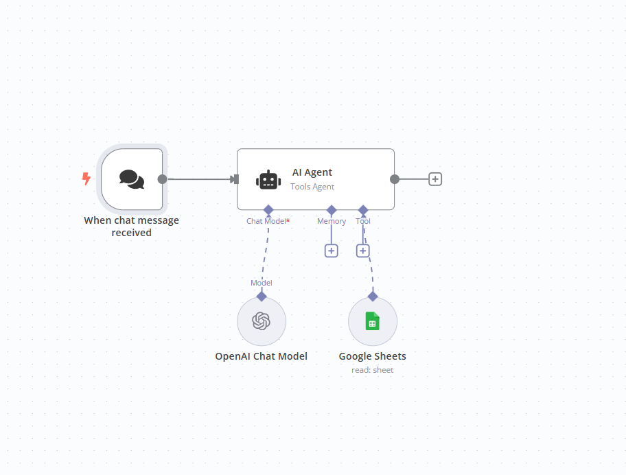
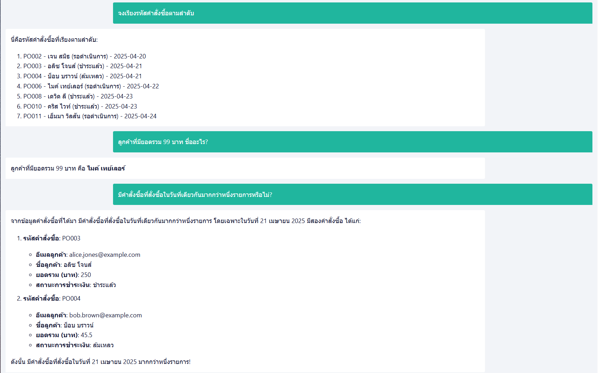

# Question to  Google sheet 

https://docs.google.com/spreadsheets/d/1gVuIaHiok6f63vwbvFz3VIgs156Ghu9IrMQ1D8k887c/edit?usp=sharing

**คำถามเกี่ยวกับรหัสคำสั่งซื้อ:**

1.  **คำถาม:** รหัสคำสั่งซื้อแรกในข้อมูลคืออะไร?
    **คำตอบ:** PO002
2.  **คำถาม:** มีคำสั่งซื้อใดบ้างที่มีรหัสขึ้นต้นด้วย "PO00"?
    **คำตอบ:** PO002, PO003, PO004, PO006, PO008, PO010, PO011
3.  **คำถาม:** รหัสคำสั่งซื้อสุดท้ายในข้อมูลคืออะไร?
    **คำตอบ:** PO011
4.  **คำถาม:** มีคำสั่งซื้อที่มีรหัส "PO005" หรือไม่?
    **คำตอบ:** ไม่มี
5.  **คำถาม:** รหัสคำสั่งซื้อใดบ้างที่มีตัวเลขสองหลักต่อท้าย "PO0"?
    **คำตอบ:** PO002, PO003, PO004, PO006, PO008, PO010, PO011
6.  **คำถาม:** จงเรียงรหัสคำสั่งซื้อตามลำดับ
    **คำตอบ:** PO002, PO003, PO004, PO006, PO008, PO010, PO011
7.  **คำถาม:** มีรหัสคำสั่งซื้อที่ซ้ำกันหรือไม่?
    **คำตอบ:** ไม่มี

**คำถามเกี่ยวกับอีเมลลูกค้า:**

8.  **คำถาม:** อีเมลของลูกค้าชื่อ เจน สมิธ คืออะไร?
    **คำตอบ:** jane.smith@example.com
9.  **คำถาม:** มีลูกค้าคนใดใช้อีเมล "alice.jones@example.com" หรือไม่?
    **คำตอบ:** มี (อลิซ โจนส์)
10. **คำถาม:** อีเมลใดบ้างที่ลงท้ายด้วย "@example.com"?
    **คำตอบ:** jane.smith@example.com, alice.jones@example.com, bob.brown@example.com, mike.taylor@example.com, david.lee@example.com, chris.white@example.com, emma.wilson@example.com
11. **คำถาม:** มีอีเมลใดที่ไม่มี "@" หรือ "." หรือไม่?
    **คำตอบ:** ไม่มี
12. **คำถาม:** ลูกค้าที่มีอีเมล "david.lee@example.com" ชื่ออะไร?
    **คำตอบ:** เดวิด ลี
13. **คำถาม:** มีลูกค้าที่มีอีเมลเดียวกันมากกว่าหนึ่งครั้งหรือไม่? (จากข้อมูลนี้)
    **คำตอบ:** ไม่มี
14. **คำถาม:** จงแสดงรายชื่ออีเมลลูกค้าทั้งหมด
    **คำตอบ:** jane.smith@example.com, alice.jones@example.com, bob.brown@example.com, mike.taylor@example.com, david.lee@example.com, chris.white@example.com, emma.wilson@example.com

**คำถามเกี่ยวกับชื่อลูกค้า:**

15. **คำถาม:** ลูกค้าคนแรกในรายการชื่ออะไร?
    **คำตอบ:** เจน สมิธ
16. **คำถาม:** มีลูกค้าชื่อ "บ็อบ บราวน์" หรือไม่?
    **คำตอบ:** มี
17. **คำถาม:** ลูกค้าที่สั่งซื้อในวันที่ 2025-04-21 ชื่ออะไรบ้าง?
    **คำตอบ:** อลิซ โจนส์, บ็อบ บราวน์
18. **คำถาม:** มีลูกค้าชื่อ "จอห์น" หรือไม่?
    **คำตอบ:** ไม่มี
19. **คำถาม:** ลูกค้าที่มียอดรวม 99 บาท ชื่ออะไร?
    **คำตอบ:** ไมค์ เทย์เลอร์
20. **คำถาม:** จงแสดงรายชื่อลูกค้าทั้งหมด
    **คำตอบ:** เจน สมิธ, อลิซ โจนส์, บ็อบ บราวน์, ไมค์ เทย์เลอร์, เดวิด ลี, คริส ไวท์, เอ็มมา วิลสัน
21. **คำถาม:** มีลูกค้าชื่อซ้ำกันหรือไม่? (จากข้อมูลนี้)
    **คำตอบ:** ไม่มี

**คำถามเกี่ยวกับวันที่สั่งซื้อ:**

22. **คำถาม:** คำสั่งซื้อแรกถูกสั่งซื้อเมื่อใด?
    **คำตอบ:** 2025-04-20
23. **คำถาม:** มีคำสั่งซื้อใดบ้างที่สั่งซื้อในเดือนเมษายน 2025?
    **คำตอบ:** PO002, PO003, PO004, PO006, PO008, PO010, PO011
24. **คำถาม:** มีคำสั่งซื้อที่สั่งซื้อในวันที่ 2025-04-25 หรือไม่?
    **คำตอบ:** ไม่มี
25. **คำถาม:** มีคำสั่งซื้อที่สั่งซื้อในวันที่เดียวกันมากกว่าหนึ่งรายการหรือไม่?
    **คำตอบ:** มี (2025-04-21 และ 2025-04-23)
26. **คำถาม:** คำสั่งซื้อล่าสุดถูกสั่งซื้อเมื่อใด?
    **คำตอบ:** 2025-04-24
27. **คำถาม:** จงเรียงลำดับวันที่สั่งซื้อจากเก่าที่สุดไปใหม่ที่สุด
    **คำตอบ:** 2025-04-20, 2025-04-21, 2025-04-21, 2025-04-22, 2025-04-23, 2025-04-23, 2025-04-24
28. **คำถาม:** มีคำสั่งซื้อในวันที่ 2024 หรือไม่?
    **คำตอบ:** ไม่มี

**คำถามเกี่ยวกับยอดรวม (บาท):**

29. **คำถาม:** ยอดรวมของคำสั่งซื้อแรกคือเท่าไหร่?
    **คำตอบ:** 89.99 บาท
30. **คำถาม:** มีคำสั่งซื้อใดบ้างที่มียอดรวมมากกว่า 100 บาท?
    **คำตอบ:** PO003 (250 บาท), PO010 (130 บาท)
31. **คำถาม:** คำสั่งซื้อใดมียอดรวมน้อยที่สุด?
    **คำตอบ:** PO004 (45.5 บาท)
32. **คำถาม:** ยอดรวมของคำสั่งซื้อที่มีรหัส "PO008" คือเท่าไหร่?
    **คำตอบ:** 60 บาท
33. **คำถาม:** มีคำสั่งซื้อใดบ้างที่มียอดรวมเป็นจำนวนเต็ม?
    **คำตอบ:** PO003 (250 บาท), PO006 (99 บาท), PO008 (60 บาท), PO010 (130 บาท)
34. **คำถาม:** ยอดรวมเฉลี่ยของคำสั่งซื้อทั้งหมดคือเท่าไหร่?
    **คำตอบ:** (89.99 + 250 + 45.5 + 99 + 60 + 130 + 75.25) / 7 = 749.74 / 7 ≈ 107.11 บาท
35. **คำถาม:** ยอดรวมสูงสุดในข้อมูลนี้คือเท่าไหร่?
    **คำตอบ:** 250 บาท

**คำถามเกี่ยวกับสถานะการชำระเงิน:**

36. **คำถาม:** สถานะการชำระเงินของคำสั่งซื้อแรกคืออะไร?
    **คำตอบ:** รอดำเนินการ
37. **คำถาม:** มีคำสั่งซื้อใดบ้างที่มีสถานะ "ชำระแล้ว"?
    **คำตอบ:** PO003, PO008, PO010
38. **คำถาม:** คำสั่งซื้อใดมีสถานะ "ล้มเหลว"?
    **คำตอบ:** PO004
39. **คำถาม:** มีคำสั่งซื้อกี่รายการที่มีสถานะ "รอดำเนินการ"?
    **คำตอบ:** 3 รายการ (PO002, PO006, PO011)
40. **คำถาม:** มีคำสั่งซื้อที่มีสถานะ "สำเร็จ" หรือไม่?
    **คำตอบ:** ไม่มี (จากข้อมูลนี้)
41. **คำถาม:** สถานะการชำระเงินของลูกค้าชื่อ เอ็มมา วิลสัน คืออะไร?
    **คำตอบ:** รอดำเนินการ
42. **คำถาม:** มีคำสั่งซื้อที่มีสถานะการชำระเงินที่แตกต่างกันกี่ประเภท?
    **คำตอบ:** 3 ประเภท (รอดำเนินการ, ชำระแล้ว, ล้มเหลว)

**คำถามแบบผสม:**

43. **คำถาม:** ลูกค้าชื่ออะไรที่สั่งซื้อในวันที่ 2025-04-23 และมียอดรวมมากกว่า 50 บาท?
    **คำตอบ:** เดวิด ลี (60 บาท), คริส ไวท์ (130 บาท)
44. **คำถาม:** คำสั่งซื้อใดบ้างที่มีสถานะ "ชำระแล้ว" และมียอดรวมน้อยกว่า 100 บาท?
    **คำตอบ:** PO008 (60 บาท)
45. **คำถาม:** อีเมลของลูกค้าที่มียอดรวมสูงสุดคืออะไร?
    **คำตอบ:** alice.jones@example.com
46. **คำถาม:** ในวันที่ 2025-04-21 มีคำสั่งซื้อที่มีสถานะการชำระเงินแตกต่างกันกี่ประเภท?
    **คำตอบ:** 2 ประเภท (ชำระแล้ว, ล้มเหลว)
47. **คำถาม:** ลูกค้าที่มีอีเมล "jane.smith@example.com" สั่งซื้อเมื่อใดและมียอดรวมเท่าไหร่?
    **คำตอบ:** 2025-04-20, 89.99 บาท
48. **คำถาม:** มีลูกค้าชื่ออะไรบ้างที่สถานะการชำระเงินคือ "รอดำเนินการ"?
    **คำตอบ:** เจน สมิธ, ไมค์ เทย์เลอร์, เอ็มมา วิลสัน
49. **คำถาม:** คำสั่งซื้อที่มีรหัส "PO003" ถูกสั่งซื้อเมื่อใดและมีสถานะการชำระเงินเป็นอย่างไร?
    **คำตอบ:** 2025-04-21, ชำระแล้ว
50. **คำถาม:** จงแสดงรายการคำสั่งซื้อทั้งหมดที่มียอดรวมมากกว่า 70 บาท
    **คำตอบ:**
    *   PO002, jane.smith@example.com, เจน สมิธ, 2025-04-20, 89.99, รอดำเนินการ
    *   PO003, alice.jones@example.com, อลิซ โจนส์, 2025-04-21, 250, ชำระแล้ว
    *   PO006, mike.taylor@example.com, ไมค์ เทย์เลอร์, 2025-04-22, 99, รอดำเนินการ
    *   PO010, chris.white@example.com, คริส ไวท์, 2025-04-23, 130, ชำระแล้ว
    *   PO011, emma.wilson@example.com, เอ็มมา วิลสัน, 2025-04-24, 75.25, รอดำเนินการ

