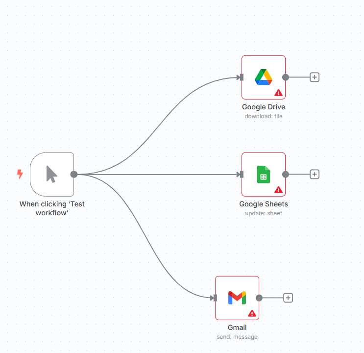
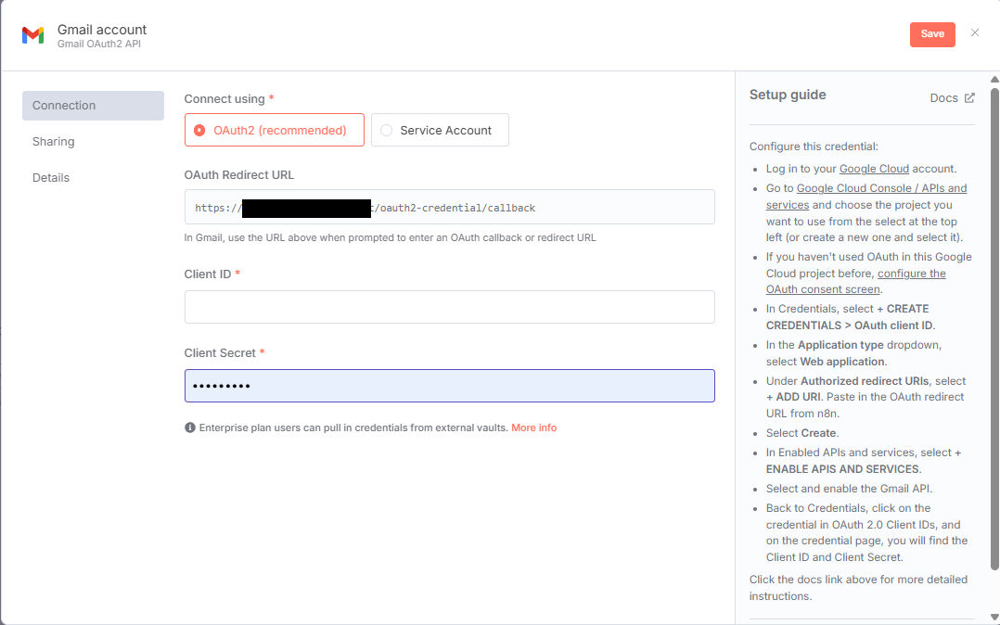
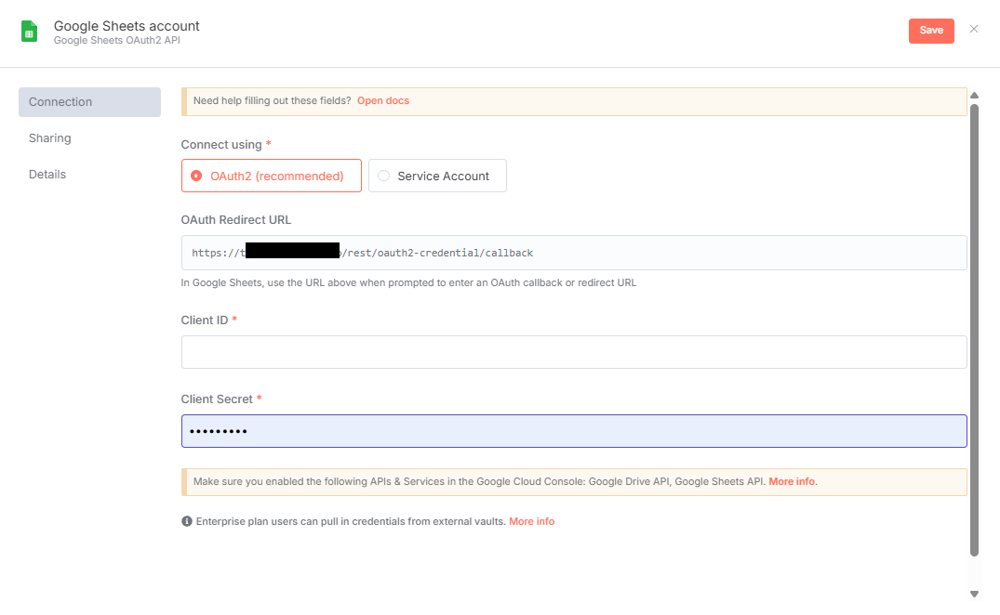
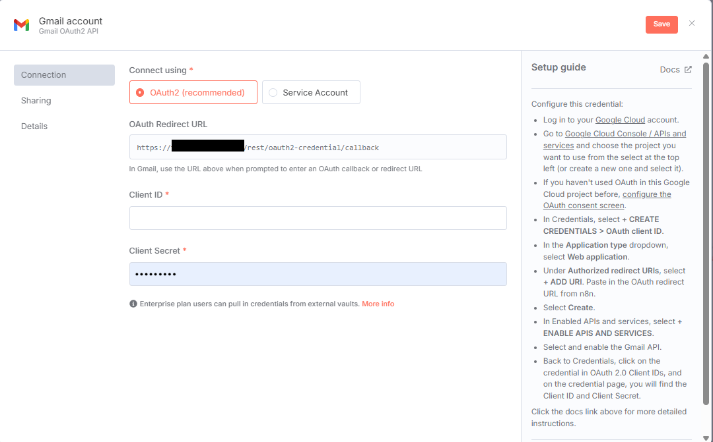
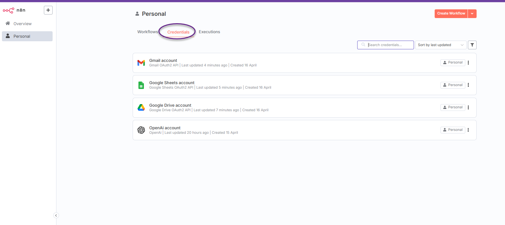

<table>
  <thead>
    <tr>
      <th>   Gmail         </th>
      <th>   Google Sheet         </th>
      <th>   Gmail Account         </th>
    </tr>
  </thead>
  <tbody>
    <tr>
      <td></td>
      <td></td>
      <td></td>
    </tr>
  </tbody>
</table>

# การตั้งค่า Google Credentials ใน n8n

สำหรับการตั้งค่าและทดสอบ Google Credentials เพื่อทำงานอัตโนมัติกับ Google Drive, Google Sheets และ Gmail

## รายละเอียด Workflow

- **ชื่อ Workflow**: Google Credentials
- **โหนด**:
  - **Manual Trigger**: เริ่ม Workflow เมื่อคลิก "Test Workflow"
  - **Google Drive**: ดาวน์โหลดไฟล์จาก Google Drive (ต้องระบุ File ID)
  - **Google Sheets**: อัปเดตชีตที่ระบุ (ต้องระบุ Document ID และ Sheet Name)
  - **Gmail**: ส่งอีเมลโดยใช้ Gmail
- **การเชื่อมต่อ**: Manual Trigger จะเรียกใช้งานโหนดทั้งสาม (Google Drive, Google Sheets, Gmail) พร้อมกัน
