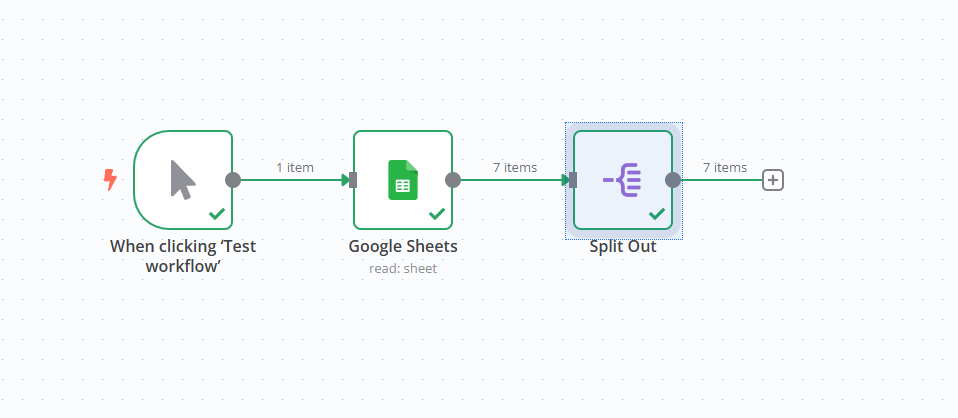
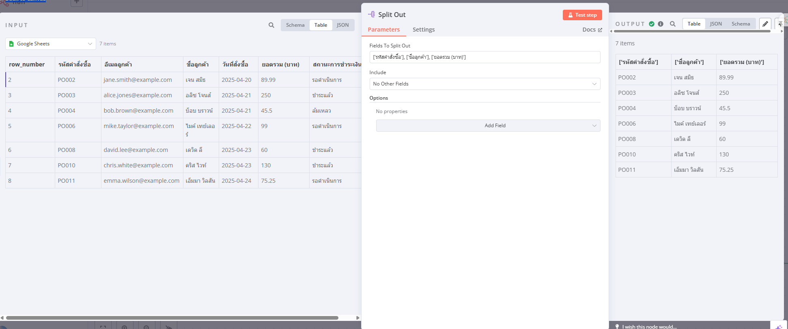

## n8n Lab: Split Data from Google Sheets

https://docs.google.com/spreadsheets/d/1gVuIaHiok6f63vwbvFz3VIgs156Ghu9IrMQ1D8k887c/edit?usp=sharing

This lab demonstrates how to use the **Split Out** node in n8n to separate specific fields retrieved from a Google Sheets document into individual items in the workflow.

**Workflow Overview:**

This simple workflow consists of the following nodes:

1.  **When clicking ‘Test workflow’**: This is a **Manual Trigger** node that initiates the workflow when you click the "Test workflow" button in the n8n editor.

2.  **Google Sheets**: This node connects to a Google Sheets document and retrieves data from a specified sheet.
    *   **Credentials**: Uses the "Google Sheets account" credentials (ID: `u2eQkXoirlzEvgLe`).
    *   **Document ID**: Configured to read data from the Google Sheet with the ID `1gVuIaHiok6f63vwbvFz3VIgs156Ghu9IrMQ1D8k887c`.
    *   **Sheet Name**: Set to read data from the sheet named "Sheet1" (identified by `gid=0`).

3.  **Split Out**: This node takes the data received from the Google Sheets node and separates it based on the specified fields.
    *   **Field to Split Out**: Configured to split out the following fields:
        *   `['รหัสคำสั่งซื้อ']` (Order ID)
        *   `['ชื่อลูกค้า']` (Customer Name)
        *   `['ยอดรวม (บาท)']` (Total Amount (THB))

**How it Works:**

1.  When the workflow is manually triggered, the **Google Sheets** node connects to the specified Google Sheet and retrieves all the rows of data from "Sheet1". Each row will be an item in the n8n workflow.

2.  The **Split Out** node then processes each incoming item (representing a row from the Google Sheet). For each item, it extracts the values of the "รหัสคำสั่งซื้อ", "ชื่อลูกค้า", and "ยอดรวม (บาท)" fields.

3.  The **Split Out** node will then output a new set of items. Instead of each item containing all the columns from the original row, each new item will contain only one of the specified fields and its corresponding value. For example, if the Google Sheet has three columns (as specified in the "Field to Split Out" parameter), each input item will result in three output items.

**To Use This Lab:**

1.  **Import the JSON code** into your n8n instance.
2.  **Connect your Google Sheets account** to the "Google Sheets" node using the provided credential ID or by creating a new connection. Ensure the connected account has access to the Google Sheet with the ID `1gVuIaHiok6f63vwbvFz3VIgs156Ghu9IrMQ1D8k887c`.
3.  **Verify the Google Sheet ID and Sheet Name** in the "Google Sheets" node to match your target spreadsheet.
4.  **Run the workflow** by clicking the "Test workflow" button.
5.  **Observe the output** of the "Split Out" node. You will see that each original row from the Google Sheet has been transformed into multiple items, each containing one of the specified fields and its value.

**Potential Use Cases:**

*   Processing specific columns from a spreadsheet individually.
*   Iterating over key pieces of information for further processing in subsequent nodes.
*   Transforming data into a different structure for other applications.

This lab provides a basic understanding of how the **Split Out** node can be used to manipulate data retrieved from external sources like Google Sheets in your n8n workflows. You can extend this concept to split out data based on various criteria and process it in numerous ways.