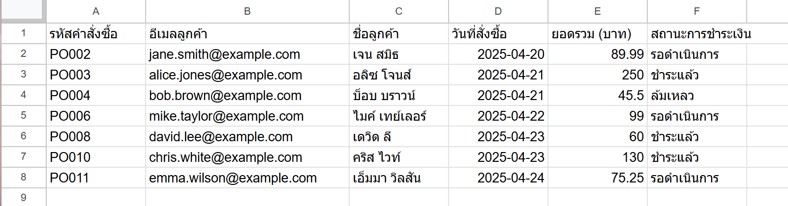
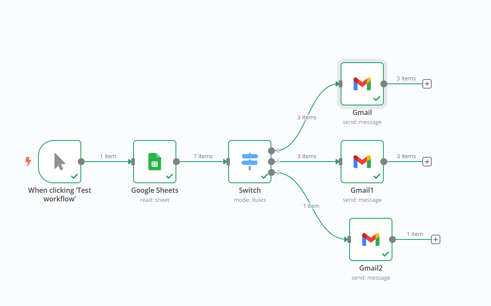
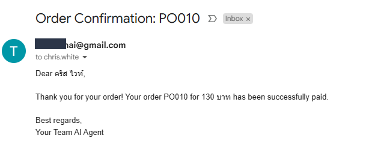
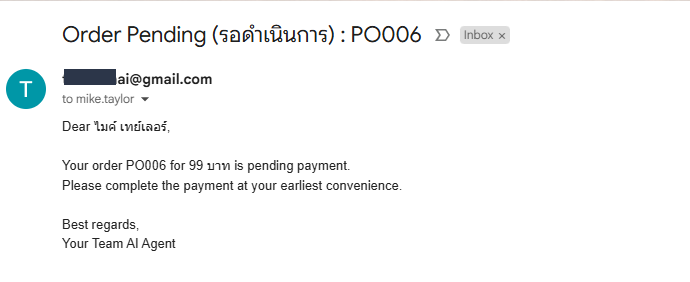
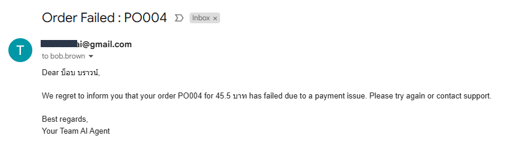

# Purchase Order Confirmation Lab

This lab demonstrates how to process a CSV file containing purchase order data and send confirmation emails to customers using n8n and Gmail.


https://docs.google.com/spreadsheets/d/1gVuIaHiok6f63vwbvFz3VIgs156Ghu9IrMQ1D8k887c/edit?usp=sharing












## Prerequisites
- [n8n](https://n8n.io/) installed (self-hosted or cloud).
- A Gmail account with [App Password](https://support.google.com/accounts/answer/185833) for SMTP (if 2FA is enabled).
- Node.js and npm (optional, for local development).
- Basic understanding of CSV files and JSON workflows.

## Project Structure


```
Subject: Order Confirmation for {{order_number}}
Dear {{customer_name}},
Thank you for your order (ID: {{id}}).
Product: {{product}}
Quantity: {{quantity}}
Total: ${{total_amount}}
Status: {{status}}
Regards,
Your Company

```