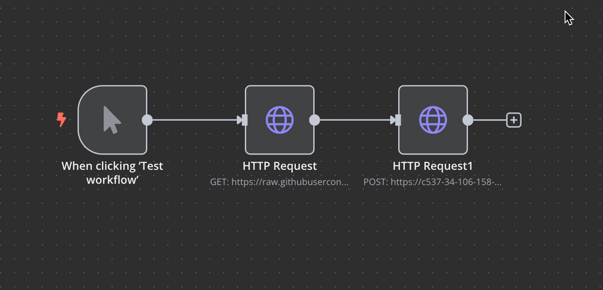

```
# Import necessary libraries
import nest_asyncio
import uvicorn
from fastapi import FastAPI, File, UploadFile, Form
from fastapi.responses import StreamingResponse, JSONResponse
from pyngrok import ngrok
import cv2
import numpy as np
from io import BytesIO
from PIL import Image
import asyncio

# Apply nest_asyncio to allow running FastAPI in Jupyter
nest_asyncio.apply()

# Initialize FastAPI app
app = FastAPI()

# Health check endpoint
@app.get("/health")
async def health_check():
    return JSONResponse(content={"status": "healthy"}, status_code=200)

# Define the image processing function
def process_image(image: np.ndarray, prompt: str) -> np.ndarray:
    # Example: Convert to grayscale if prompt contains "grayscale"
    if "grayscale" in prompt.lower():
        processed_image = cv2.cvtColor(image, cv2.COLOR_RGB2GRAY)
        # Convert back to 3 channels for consistency
        processed_image = cv2.cvtColor(processed_image, cv2.COLOR_GRAY2RGB)
    else:
        # Default: return original image
        processed_image = image
    return processed_image

# FastAPI endpoint to handle image upload and prompt
@app.post("/process-image/")
async def process_image_endpoint(file: UploadFile = File(...), prompt: str = Form(...)):
    # Read the uploaded image
    image_data = await file.read()
    image = Image.open(BytesIO(image_data)).convert("RGB")
    image_np = np.array(image)

    # Process the image based on the prompt
    processed_image_np = process_image(image_np, prompt)

    # Convert processed image back to bytes
    processed_image_pil = Image.fromarray(processed_image_np)
    output_buffer = BytesIO()
    processed_image_pil.save(output_buffer, format="PNG")
    output_buffer.seek(0)

    # Return the processed image as a streaming response
    return StreamingResponse(output_buffer, media_type="image/png")


# Function to start ngrok and FastAPI server
async def start_server(Token_ngrok):
    # Set your ngrok authtoken
    ngrok.set_auth_token(Token_ngrok)  # Replace with your ngrok authtoken

    # Start ngrok tunnel
    public_url = ngrok.connect(8000, bind_tls=True).public_url
    print(f"ngrok public URL: {public_url}")

    # Configure and run the FastAPI server
    config = uvicorn.Config(app, host="0.0.0.0", port=8000)
    server = uvicorn.Server(config)
    await server.serve()


```


```
Token_ngrok = "xxxxxxxxxxxxxxxxxxxxxxxxxxxxxxxxxxxxxxx"  # Replace with your ngrok authtoken
# Run the server
asyncio.run(start_server(Token_ngrok ))
```