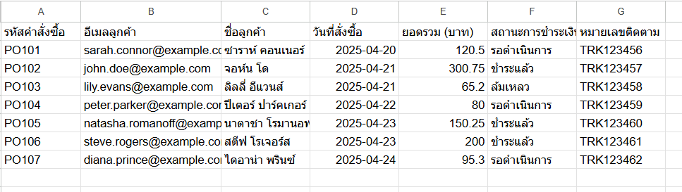
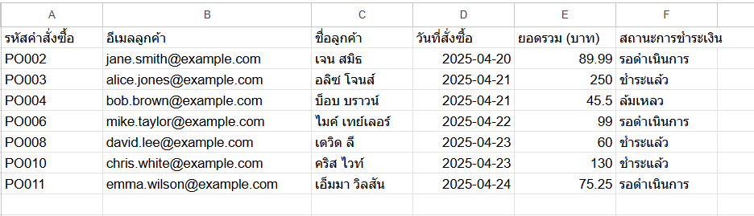
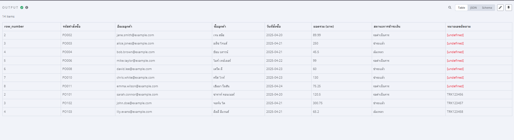
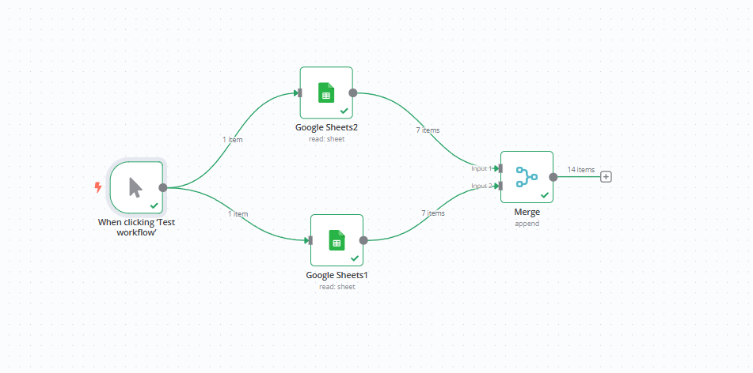

# Google Sheets Data Merge Workflow Lab

https://docs.google.com/spreadsheets/d/1gVuIaHiok6f63vwbvFz3VIgs156Ghu9IrMQ1D8k887c/edit?usp=sharing

## Description

This lab demonstrates how to create an automated workflow using n8n to retrieve data from two Google Sheets and merge the results into a single output. This is a fundamental example of data integration and automation using no-code tools.

## Objective

The primary objective of this lab is to learn how to:

*   Connect n8n to Google Sheets using OAuth2 authentication.
*   Retrieve data from specific sheets within a Google Sheets document.
*   Utilize the Merge node in n8n to combine data from multiple sources.
*   Understand the basic structure and execution flow of an n8n workflow.

## Tools Used

*   **n8n**: An open-source workflow automation tool.
*   **Google Sheets**: For storing and retrieving data.

## Workflow Overview

This workflow is designed to perform the following steps:

1.  **Trigger Manually**: Initiate the workflow on demand using the "Test workflow" button in the n8n interface.
2.  **Fetch Data from Sheet 1**: Retrieve data from a specific sheet within a Google Sheets document.
3.  **Fetch Data from Sheet 2**: Retrieve data from another specific sheet within the same Google Sheets document.
4.  **Merge Data**: Combine the data retrieved from both sheets into a single dataset.
5.  **Output**: The merged data can then be used for further processing or analysis (though not explicitly shown in this basic lab).

