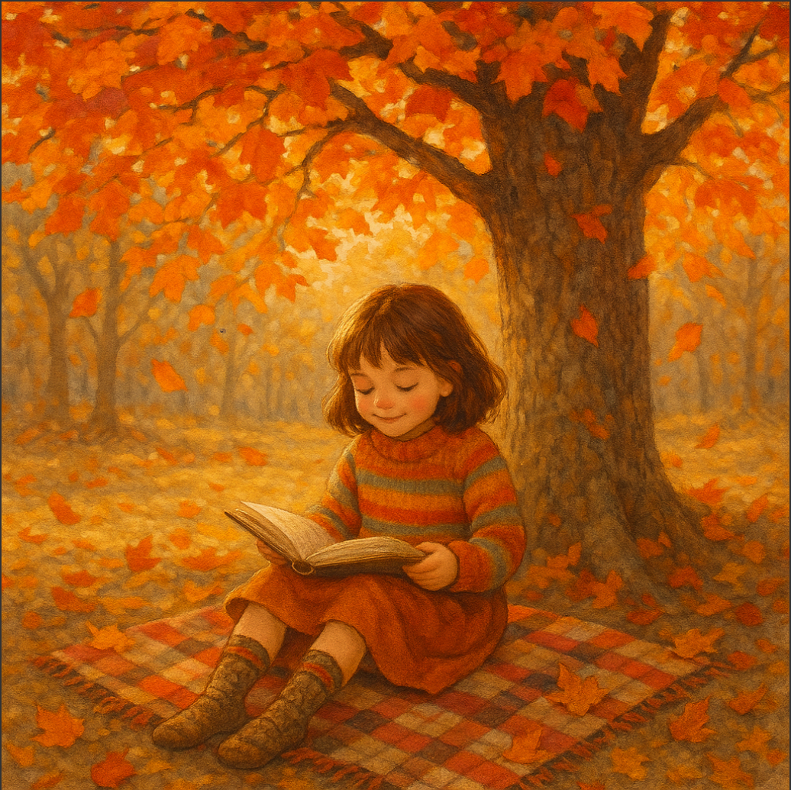

https://platform.openai.com/docs/guides/image-generation?image-generation-model=gpt-image-1


```


1. สร้างรูปแมวกำลังเดินเล่นอยู่ในก้อนเมฆที่มีนางฟ้าอยู่ด้านหลัง
2. เด็กผู้หญิงนั่งอ่านหนังสือใต้ต้นไม้ใหญ่ในฤดูใบไม้ร่วง
3. หุ่นยนต์นั่งจิบกาแฟในร้านคาเฟ่ยุคอนาคต
4. มังกรบินอยู่เหนือภูเขาหิมะยามพระอาทิตย์ตก
5. นกยูงกำลังกางหางท่ามกลางทุ่งดอกไม้
6. รถไฟวิ่งผ่านสะพานไม้โบราณในหมู่บ้านญี่ปุ่น
7. นักรบโบราณกำลังขี่ม้าในพายุทะเลทราย
8. เด็กชายและหมานั่งดูดาวบนดาดฟ้า
9. ปราสาทลอยฟ้าท่ามกลางหมอกยามเช้า
10. เต่าทะเลว่ายน้ำกับปลาโลมาใต้ทะเลลึก
11. นางเงือกนั่งอยู่บนโขดหินกลางทะเลในคืนพระจันทร์เต็มดวง
12. นักบินอวกาศลอยตัวอยู่หน้าดาวโลก
13. ตลาดไทยโบราณที่มีเรือพายและของกินหลากหลาย
14. ป่ามหัศจรรย์ที่ต้นไม้เปล่งแสงสีฟ้า
15. หญิงสาวในชุดไทยโบราณยืนท่ามกลางทุ่งดอกบัว
16. เด็กกำลังเล่นว่าวบนชายหาดยามเย็น
17. สุนัขพันธุ์โกลเด้นวิ่งเล่นในสนามหญ้ากว้าง
18. ยักษ์กำลังนอนพักผ่อนใต้ต้นไม้ใหญ่
19. กระต่ายนั่งจิบชาในสวนอังกฤษ
20. สาวนักวิทยาศาสตร์กำลังทดลองในห้องแล็บแห่งอนาคต
21. เรือใบลอยกลางทะเลท่ามกลางสายรุ้ง
22. ดอกซากุระร่วงหล่นในสวนญี่ปุ่นโบราณ
23. เด็กชายขี่จักรยานผ่านอุโมงค์ดอกไม้
24. หมีแพนด้านั่งกินไผ่อย่างสบายใจ
25. แมวนั่งบนขอบหน้าต่างในวันที่ฝนตก
26. นักมายากลกำลังแสดงเวทมนตร์ในโรงละคร
27. ฟาร์มออร์แกนิกกลางหุบเขาในฤดูใบไม้ผลิ
28. ปราสาทหิมะที่มีแสงเหนืออยู่บนฟ้า
29. เด็กหญิงเต้นระบำใต้สายฝน
30. ซอมบี้เดินอยู่ในเมืองร้างยามค่ำคืน
31. นกฮูกกำลังอ่านหนังสือในห้องสมุดโบราณ
32. นักสำรวจยืนบนยอดเขาและมองไปยังดวงจันทร์
33. สาวในชุดนักบินยืนหน้าเครื่องบินโบราณ
34. ลิงกำลังวาดภาพอยู่ในป่า
35. แมวน้ำเล่นลูกบอลบนพื้นน้ำแข็ง
36. หญิงชรานั่งถักไหมพรมในบ้านไม้
37. เด็กชายจ้องดูดาวผ่านกล้องโทรทรรศน์
38. นางฟ้ากำลังโปรยแสงดาวลงมายังพื้นโลก
39. โรงเรียนเวทมนตร์ลอยอยู่เหนือทะเลหมอก
40. เด็กหญิงถือร่มสีรุ้งเดินกลางสายฝน
41. ชายหนุ่มกำลังบรรเลงเปียโนริมทะเล
42. ป่าไม้ที่มีต้นไม้พูดได้และสัตว์ประหลาดมิตรสหาย
43. รถยนต์คลาสสิกวิ่งผ่านถนนบนเทือกเขาแอลป์
44. หญิงสาวในชุดกิโมโนเดินผ่านตรอกโบราณของญี่ปุ่น
45. หมาไซบีเรียนกำลังลากเลื่อนบนหิมะ
46. เด็กๆ นั่งรอบกองไฟเล่าเรื่องผีในป่า
47. มังกรน้ำใสกำลังว่ายวนรอบเกาะกลางทะเล
48. นักบินอวกาศปลูกดอกไม้บนดาวอังคาร
49. แมวใส่ชุดซามูไรยืนบนหลังคาในคืนฝนตก
50. ปิกนิกครอบครัวในทุ่งหญ้ากับท้องฟ้าสีชมพูยามเย็น

```


ตัวอย่าง

เด็กผู้หญิงนั่งอ่านหนังสือใต้ต้นไม้ใหญ่ในฤดูใบไม้ร่วง





```

ในฤดูใบไม้ร่วงที่เต็มไปด้วยเสน่ห์ เด็กผู้หญิงคนหนึ่งนั่งอยู่ใต้ต้นไม้ใหญ่ที่มีใบไม้หลากสีสัน เปลี่ยนจากสีเขียวสดชื่นเป็นสีส้ม แดง และเหลืองที่สวยงาม ใบไม้ที่ร่วงหล่นรอบตัวเธอสร้างความรู้สึกอบอุ่นและสงบ ราวกับว่าโลกใบนี้ได้ถูกสร้างขึ้นจากธรรมชาติที่งดงาม


แสงแดดอ่อนๆ ส่องลอดผ่านกิ่งก้านของต้นไม้ ทำให้พื้นดินมีเงาและแสงที่นุ่มนวล เธอสวมเสื้อกันหนาวที่อุ่นสบาย ทำให้เธอรู้สึกปลอดภัยในความเย็นของฤดู ใส่ชุดกระโปรงยาวที่คลุมเข่าซึ่งมีลวดลายที่สดใส และถุงเท้าสูงที่เพิ่มความน่ารักให้กับเธอ


เมื่อเธอนั่งอยู่บนผ้าห่มลายเต่าทองที่กระจายอยู่บนพื้นหญ้า เธอเปิดหนังสือที่เต็มไปด้วยเรื่องราวและจินตนาการ ขณะที่อ่านอยู่ เธอเหมือนหลุดเข้าไปในโลกที่หนังสือเล่าให้ฟัง อาจจะเป็นโลกแห่งเวทมนตร์ หรือการผจญภัยที่น่าตื่นเต้น ทุกตัวอักษรในหนังสือทำให้เธอรู้สึกถึงอารมณ์ ความฝัน และการค้นพบ


ภาพนี้ถูกเติมเต็มด้วยความเงียบสงบ ซึ่งทำให้ผู้ที่มองเห็นรู้สึกถึงความแจ่มใสในใจ การอ่านหนังสือในธรรมชาติไม่เพียงแต่ช่วยให้เธอผ่อนคลาย แต่ยังเปิดโอกาสให้เธอได้ใช้จินตนาการและสำรวจโลกใหม่ๆ ในขณะที่รอบตัวเธอถูกล้อมรอบด้วยความงดงามของฤดูใบไม้ร่วง


เด็กผู้หญิงคนนี้จึงเป็นตัวแทนของความสุขในช่วงเวลาที่เธอสามารถหลบหนีจากความวุ่นวายของโลกภายนอก และค้นพบความรักในการอ่านและธรรมชาติที่มอบให้กับเธอ โดยไม่มีอะไรจะรบกวนจิตใจ ความสงบเหล่านี้เป็นสิ่งที่ควรค่าแก่การรักษาในชีวิตของเราทุกคน.


```