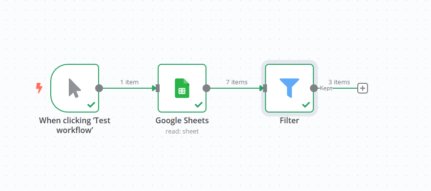
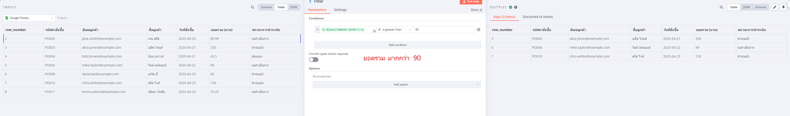
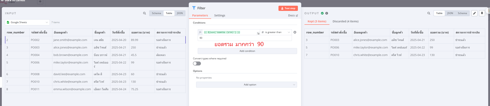

## n8n Lab: Filtering Google Sheets Data

https://docs.google.com/spreadsheets/d/1gVuIaHiok6f63vwbvFz3VIgs156Ghu9IrMQ1D8k887c/edit?usp=sharing

This n8n lab demonstrates how to **read data from a Google Sheet and filter it based on a specific condition**.

**Workflow Description:**

The workflow consists of the following nodes:

1.  **When clicking ‘Test workflow’ (Manual Trigger):**
    *   This node serves as the starting point of the workflow. It allows you to manually trigger the workflow execution by clicking the "Test workflow" button in the n8n editor.

2.  **Google Sheets:**
    *   This node connects to your Google Sheets account and retrieves data from a specified sheet.
    *   **Credentials:** Uses the "Google Sheets account" credential (ID: `u2eQkXoirlzEvgLe`). Ensure you have this credential configured to access your Google Sheets.
    *   **Document ID:** Configured to read data from the Google Sheet with the ID: `1gVuIaHiok6f63vwbvFz3VIgs156Ghu9IrMQ1D8k887c`.
    *   **Sheet Name:** Set to read data from the sheet named "Sheet1" (identified by `gid=0`).

3.  **Filter:**
    *   This node receives the data from the "Google Sheets" node and applies a filter condition.
    *   **Condition:** It checks if the value in the field named "`ยอดรวม (บาท)`" (Total Amount (THB)) is **greater than 90**.
    *   **Case Sensitive:** The filtering is case-sensitive.
    *   **Type Validation:** Strict type validation is enabled for the comparison.
