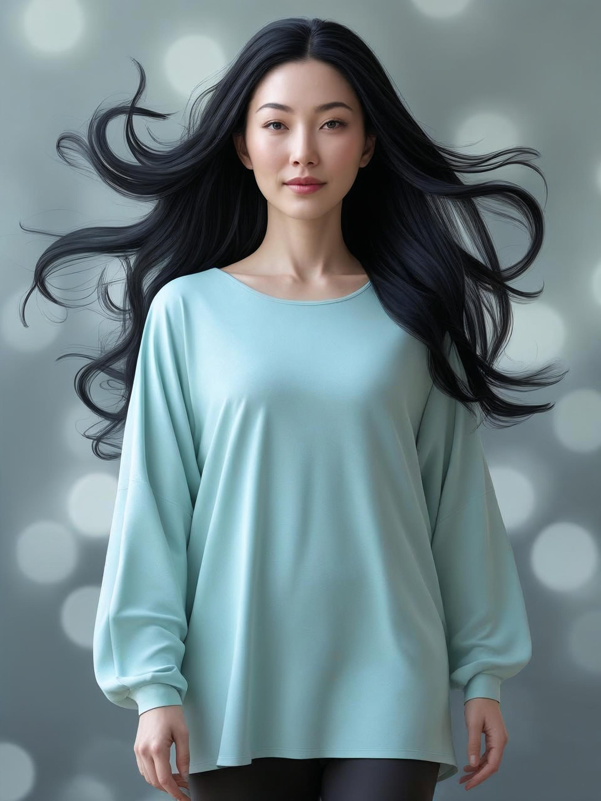
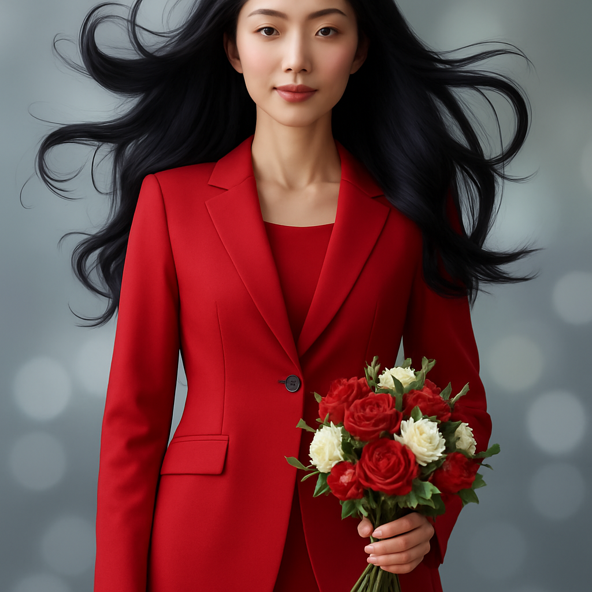
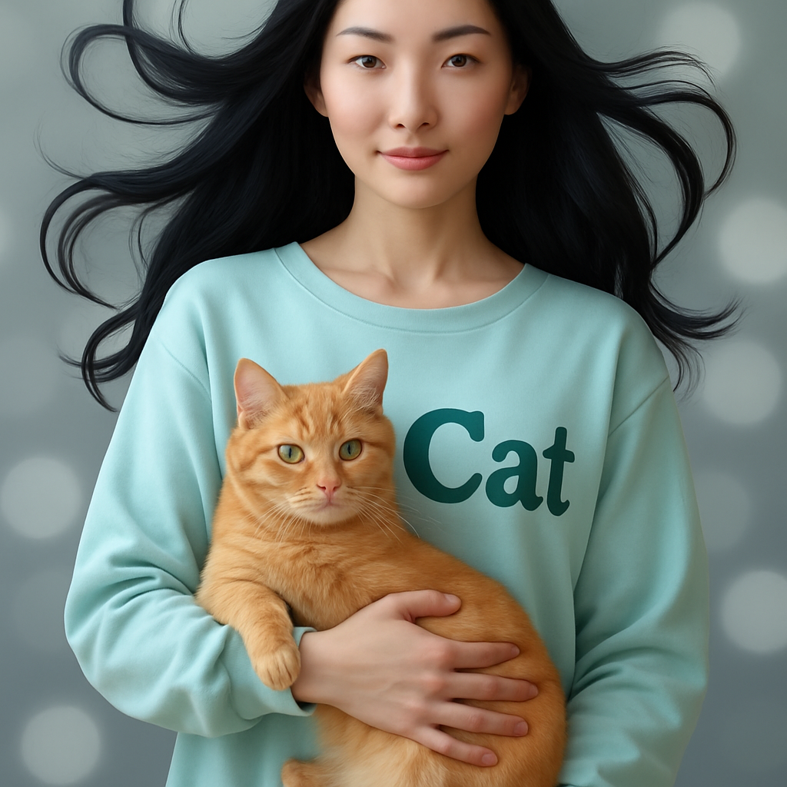

https://platform.openai.com/docs/guides/image-generation?image-generation-model=gpt-image-1

# ตัวอย่าง

### เพิ่มชุดสูทผู้หญิงแดง เข้าไปในรูป พร้อมช่อดอกไม้ในมือ

### ทำให้ผู้หญิงในรูปอุ้มแมวสีส้ม พร้อม ลายบนชุดผู้หญิงว่า Cat

