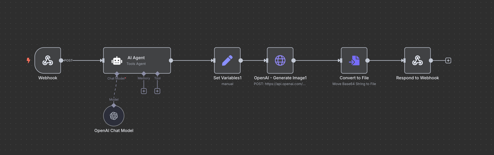

### Prompt List

```


1. สร้างรูปแมวกำลังเดินเล่นอยู่ในก้อนเมฆที่มีนางฟ้าอยู่ด้านหลัง
2. เด็กผู้หญิงนั่งอ่านหนังสือใต้ต้นไม้ใหญ่ในฤดูใบไม้ร่วง
3. หุ่นยนต์นั่งจิบกาแฟในร้านคาเฟ่ยุคอนาคต
4. มังกรบินอยู่เหนือภูเขาหิมะยามพระอาทิตย์ตก
5. นกยูงกำลังกางหางท่ามกลางทุ่งดอกไม้
6. รถไฟวิ่งผ่านสะพานไม้โบราณในหมู่บ้านญี่ปุ่น
7. นักรบโบราณกำลังขี่ม้าในพายุทะเลทราย
8. เด็กชายและหมานั่งดูดาวบนดาดฟ้า
9. ปราสาทลอยฟ้าท่ามกลางหมอกยามเช้า
10. เต่าทะเลว่ายน้ำกับปลาโลมาใต้ทะเลลึก
11. นางเงือกนั่งอยู่บนโขดหินกลางทะเลในคืนพระจันทร์เต็มดวง
12. นักบินอวกาศลอยตัวอยู่หน้าดาวโลก
13. ตลาดไทยโบราณที่มีเรือพายและของกินหลากหลาย
14. ป่ามหัศจรรย์ที่ต้นไม้เปล่งแสงสีฟ้า
15. หญิงสาวในชุดไทยโบราณยืนท่ามกลางทุ่งดอกบัว
16. เด็กกำลังเล่นว่าวบนชายหาดยามเย็น
17. สุนัขพันธุ์โกลเด้นวิ่งเล่นในสนามหญ้ากว้าง
18. ยักษ์กำลังนอนพักผ่อนใต้ต้นไม้ใหญ่
19. กระต่ายนั่งจิบชาในสวนอังกฤษ
20. สาวนักวิทยาศาสตร์กำลังทดลองในห้องแล็บแห่งอนาคต
21. เรือใบลอยกลางทะเลท่ามกลางสายรุ้ง
22. ดอกซากุระร่วงหล่นในสวนญี่ปุ่นโบราณ
23. เด็กชายขี่จักรยานผ่านอุโมงค์ดอกไม้
24. หมีแพนด้านั่งกินไผ่อย่างสบายใจ
25. แมวนั่งบนขอบหน้าต่างในวันที่ฝนตก
26. นักมายากลกำลังแสดงเวทมนตร์ในโรงละคร
27. ฟาร์มออร์แกนิกกลางหุบเขาในฤดูใบไม้ผลิ
28. ปราสาทหิมะที่มีแสงเหนืออยู่บนฟ้า
29. เด็กหญิงเต้นระบำใต้สายฝน
30. ซอมบี้เดินอยู่ในเมืองร้างยามค่ำคืน
31. นกฮูกกำลังอ่านหนังสือในห้องสมุดโบราณ
32. นักสำรวจยืนบนยอดเขาและมองไปยังดวงจันทร์
33. สาวในชุดนักบินยืนหน้าเครื่องบินโบราณ
34. ลิงกำลังวาดภาพอยู่ในป่า
35. แมวน้ำเล่นลูกบอลบนพื้นน้ำแข็ง
36. หญิงชรานั่งถักไหมพรมในบ้านไม้
37. เด็กชายจ้องดูดาวผ่านกล้องโทรทรรศน์
38. นางฟ้ากำลังโปรยแสงดาวลงมายังพื้นโลก
39. โรงเรียนเวทมนตร์ลอยอยู่เหนือทะเลหมอก
40. เด็กหญิงถือร่มสีรุ้งเดินกลางสายฝน
41. ชายหนุ่มกำลังบรรเลงเปียโนริมทะเล
42. ป่าไม้ที่มีต้นไม้พูดได้และสัตว์ประหลาดมิตรสหาย
43. รถยนต์คลาสสิกวิ่งผ่านถนนบนเทือกเขาแอลป์
44. หญิงสาวในชุดกิโมโนเดินผ่านตรอกโบราณของญี่ปุ่น
45. หมาไซบีเรียนกำลังลากเลื่อนบนหิมะ
46. เด็กๆ นั่งรอบกองไฟเล่าเรื่องผีในป่า
47. มังกรน้ำใสกำลังว่ายวนรอบเกาะกลางทะเล
48. นักบินอวกาศปลูกดอกไม้บนดาวอังคาร
49. แมวใส่ชุดซามูไรยืนบนหลังคาในคืนฝนตก
50. ปิกนิกครอบครัวในทุ่งหญ้ากับท้องฟ้าสีชมพูยามเย็น

```

## Prompt to create HTML code
```
create html code for image generation from text project with javascript and css styles.  The input from text is send to web hook server with POST request
to url=xxx and then receive respond with binary image file from web hook server and show image in page
```


# HTML Code for Image Generation from Text
```
<!DOCTYPE html>
<html lang="en">
<head>
  <meta charset="UTF-8" />
  <meta name="viewport" content="width=device-width, initial-scale=1.0"/>
  <title>Text to Image Generator</title>
  <style>
    body {
      font-family: sans-serif;
      background: #f4f4f4;
      padding: 40px;
      text-align: center;
    }

    h1 {
      margin-bottom: 20px;
    }

    input[type="text"] {
      padding: 10px;
      width: 60%;
      max-width: 500px;
      border: 1px solid #ccc;
      border-radius: 4px;
      font-size: 16px;
    }

    button {
      margin-left: 10px;
      padding: 10px 20px;
      font-size: 16px;
      border: none;
      background: #007bff;
      color: white;
      border-radius: 4px;
      cursor: pointer;
    }

    button:hover {
      background: #0056b3;
    }

    #image-container {
      margin-top: 30px;
    }

    img {
      max-width: 100%;
      height: auto;
      border: 1px solid #ccc;
      border-radius: 6px;
    }
  </style>
</head>
<body>
  <h1>Generate Image from Text</h1>
  <input type="text" id="textInput" placeholder="Describe the image..." />
  <button onclick="generateImage()">Generate</button>

  <div id="image-container"></div>

  <script>
    async function generateImage() {
      const inputText = document.getElementById("textInput").value;
      const imageContainer = document.getElementById("image-container");

      imageContainer.innerHTML = "Loading image...";

      try {
        const response = await fetch("xxx", {
          method: "POST",
          headers: {
            "Content-Type": "application/json"
          },
          body: JSON.stringify({ text: inputText })
        });

        if (!response.ok) throw new Error("Image generation failed");

        const blob = await response.blob();
        const imageUrl = URL.createObjectURL(blob);

        imageContainer.innerHTML = ``;
      } catch (error) {
        imageContainer.innerHTML = `<p style="color:red;">Error: ${error.message}</p>`;
      }
    }
  </script>
</body>
</html>


```